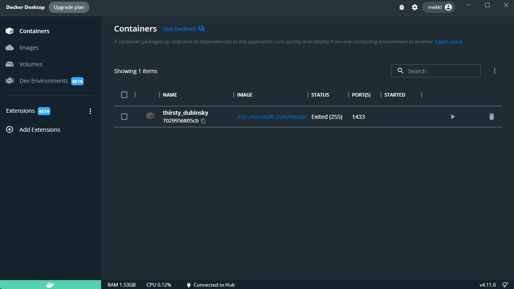

[](https://github.com/mekkl/dotnet-starter-template/actions/workflows/dotnet-build-codecov.yml)
[](https://sonarcloud.io/summary/new_code?id=mekkl_dotnet-starter-template)
[](https://github.com/mekkl/dotnet-starter-template/actions/workflows/codeql-analysis.yml)
[](https://codecov.io/gh/mekkl/dotnet-starter-template)
[](https://sonarcloud.io/summary/new_code?id=mekkl_dotnet-starter-template)
[](https://sonarcloud.io/summary/new_code?id=mekkl_dotnet-starter-template)

# Introduction 
Starter dotnet project template with:
- ...
- ...

# Table of Content

- [Getting Started](#getting-started)
  * [Setting up database for development](#setting-up-database-for-development)
  * [Startup (without Docker)](#startup--without-docker-)
  * [Startup (with Docker)](#startup--with-docker-)
  * [Build and Test](#build-and-test)
- [Entity Framework](#entity-framework)
  * [Add migration](#add-migration)
  * [Apply migration](#apply-migration)
  * [Apply specific migration (rollback to previous)](#apply-specific-migration--rollback-to-previous-)
  * [Remove migration (latest migration)](#remove-migration--latest-migration-)
  * [List migrations](#list-migrations)
- [Nuget versions update](#nuget-versions-update)
- [Other Resources](#other-resources)
  * [Benchmark testing](#benchmark-testing)
  * [Load testing](#load-testing)
  * [Versioning](#versioning)
  * [API Versioning](#api-versioning)
  * [JSON Serialize](#json-serialize)
  * [SignalR](#signalr)
  * [Test resources](#test-resources)
  * [Enforce HTTPS](#enforce-https)
  * [E2E (End-to-end) testing](#e2e--end-to-end--testing)
  * [Fluent Validation Doc](#fluent-validation-doc)
  * [Codecov (coverage report)](#codecov--coverage-report-)

# Getting Started

## Setting up database for development
This solution is utilizing Docker container with a SQL server image when running the server locally.

First install Docker Desktop from https://www.docker.com/products/docker-desktop/

When installed open the commandline and execute the following to install the latest SQL server image:

``` 
docker pull mcr.microsoft.com/mssql/server:2022-latest
```

To start the container, use the following docker command:

```
docker run -e "ACCEPT_EULA=Y" -e "SA_PASSWORD=yourStrong(!)Password" -p 1433:1433 -d mcr.microsoft.com/mssql/server:2022-latest
```

> Afterwards the container can be started/stopped via. the "play" botton in the `Containers` section via. Docker Desktop. 




Ensure that this setting is found in the `appsettings.*.json` file(s).

``` json
{
      "Azure": {
            "SqlConnectionString": "Data Source=localhost,1433; Persist Security Info=True;User ID=SA;Password=yourStrong(!)Password; TrustServerCertificate=True"
      }
}
```

## Startup (without Docker)
First download and install the .NET Core SDK [here](https://dotnet.microsoft.com/download).

> You can check to see if you have installed the .Net Core SDK version (currently using the latest 6.0) with this command ```$ dotnet --version```

To startup the API open up a console, at the project root. 

Firstly go to the ```Presentation.WebApi``` folder:
```
cd Presentation.WebApi
```

Then start the API application with the following command:
```
dotnet run
```

The output from the command should display which url and port the API is listining on:
```
info: Microsoft.Hosting.Lifetime[0]
      Now listening on: https://localhost:5001
info: Microsoft.Hosting.Lifetime[0]
      Now listening on: http://localhost:5000
info: Microsoft.Hosting.Lifetime[0]
      Application started. Press Ctrl+C to shut down.
info: Microsoft.Hosting.Lifetime[0]
      Hosting environment: Development
info: Microsoft.Hosting.Lifetime[0]
      Content root path: C:\Users\ML\Desktop\portfolio-web\web-api
```

## Startup (with Docker)

TODO: Setup docker network between app and db container

First download and install Docker from [here](https://docs.docker.com/get-docker/).

> A Microsoft guide can also be found [here](https://learn.microsoft.com/en-us/dotnet/core/docker/build-container?tabs=windows)

Create the image:
```
docker build -t <IMAGE_NAME> -f ./MinimalApi/Dockerfile .
```

Create the container
```
docker create --name <CONTAINER_NAME> -p 8081:80 -p 8082:443 <IMAGE_NAME>
```

The output of the create command will produce a `CONTAINER ID` like:
```
7d69d4022efd7eb5190c0156e6c41f2b5d0fead44c50c3e29d4056bfc6c65bf1
```

You can list all containers with:
```
docker ps -a
```

Starting a container:
```
docker start <CONTAINER_NAME>
```

Or start from image:
```
docker run --name <CONTAINER_NAME> -p 8081:80 -p 8082:443 -d <IMAGE_NAME>
```

Stopping a container:
```
docker stop <CONTAINER_NAME>
```

## (TODO) Docker with HTTPS
To be worked on...

## Docker with compose
Some notes on used composed setup.
- When using Docker compose as is, the environment is set to production. Keep this in mind for flows that depends on specific environments
- The connection string, with this setup, needs to have the `localhost` replaced with the service name of the database name in the `compose.yml` file. The production connection string therefore contains `db` instead of `localhost`

Start compose:
```
docker compose up -d   
```

List containers:
```
docker ps
```

Shutdown:
```
docker compose down
```

## Build and Test
Command for building the project (run the command at the project root):
```
dotnet build
```

Command for running all tests (run the command at the project root):
```
dotnet test
```

Command for running all tests, and generating coverage data. The result is ending op in each test project in the dir ```Tests/TestResults/<GUID>/coverage.cobertura.xml```
```
dotnet test --collect:"XPlat Code Coverage" --settings Tests/coverlet.runsettings
```

Command for generating coverage report from results:
```
reportgenerator "-reports:*/TestResults/**/coverage.info" "-targetdir:Tests/CoverageReports" -reporttypes:html
```
> Usage of **reportgenerator** see: https://github.com/danielpalme/ReportGenerator

# Entity Framework

Link: https://docs.microsoft.com/en-us/ef/core/managing-schemas/migrations/?tabs=vs

`Microsoft.EntityFrameworkCore.Design` This package is required for the Entity Framework Core Tools to work.

> `Microsoft.EntityFrameworkCore.Tools` nuget enables Package Manager Console commands

> When using the Package Manager Console, set default Project to `Infrastructure`

## Add migration 
```
add-migration <migration-name> -OutputDir Your\Directory 
```

``` 
dotnet ef migrations add InitialCreate --project .\Infrastructure\ --startup-project .\MinimalApi\
```

## Apply migration
```
update-database
```

``` 
dotnet ef database update --project .\Infrastructure\ --startup-project .\MinimalApi\
```

## Apply specific migration (rollback to previous)
```
Update-Database <previous-migration-name>
```

```
dotnet ef database update <previous-migration-name> --project .\Infrastructure\ --startup-project .\MinimalApi\
```

## Remove migration (latest migration)
```
> Remove-Migration
```

```
dotnet ef migrations remove --project .\Infrastructure\ --startup-project .\MinimalApi\
```

## List migrations
```
Get-Migration
```

```
dotnet ef migrations list --project .\Infrastructure\ --startup-project .\MinimalApi\
```

# Nuget versions update
When having this project in GitHub the `Dependabot` can be used to automatically create pull requests when new releases of dependencies is available. See more [here](https://github.com/dependabot)

A tool for checking dependencies locally can also be used. In these examples is `dotnet-outdated` utilized. See more [here](https://github.com/dotnet-outdated/dotnet-outdated).

First install the tool:
```
dotnet tool install --global dotnet-outdated-tool
```

Or if the tool is already installed, it can be updated with:
```
dotnet tool update --global dotnet-outdated-tool
```

Command for checking nuget version
```
dotnet outdated
```

Command for checking nuget version and upgrade
```
dotnet outdated -u
```

# Used Resources/Insirations

## Benchmark testing
See: https://github.com/dotnet/BenchmarkDotNet

## Load testing
See: https://www.youtube.com/watch?v=r-Jte8Y8zag

## Versioning
See: https://medium.com/fiverr-engineering/major-minor-patch-a5298e2e1798

## API Versioning
See: https://www.youtube.com/watch?v=iVHtKG0eU_s
See: https://dev.to/htissink/asp-net-core-api-path-versioning-197o

## JSON Serialize
See: https://github.com/neuecc/Utf8Json

## SignalR
See: https://docs.microsoft.com/en-us/aspnet/core/signalr/streaming?view=aspnetcore-6.0

## Test resources
- https://dejanstojanovic.net/aspnet/2020/may/setting-up-code-coverage-reports-in-azure-devops-pipeline/
- https://medium.com/@tarik.nzl/publishing-test-coverage-with-net-core-and-vsts-build-pipelines-39a2f29dfa12
- https://docs.microsoft.com/en-us/dotnet/core/testing/unit-testing-code-coverage?tabs=windows
- Install ReportGenerator for DevOps for usage in pipeline: https://www.jamescroft.co.uk/combining-multiple-code-coverage-results-in-azure-devops/
- https://github.com/coverlet-coverage/coverlet/blob/master/Documentation/VSTestIntegration.md
- https://github.com/coverlet-coverage/coverlet
- https://coveralls.io/
- https://docs.specflow.org/projects/specflow/en/latest/vscode/test-execution.html

- Maybe see for multiple test projects: https://jpenniman.blogspot.com/2019/10/code-coverage-for-multiple-projects-in.html

## Enforce HTTPS
- https://docs.microsoft.com/en-us/aspnet/core/security/enforcing-ssl?view=aspnetcore-6.0&tabs=visual-studio

## E2E (End-to-end) testing
- https://playwright.dev/dotnet/

## Fluent Validation Doc
- https://docs.fluentvalidation.net/en/latest/inheritance.html

## Codecov (coverage report)
- https://github.com/codecov/codecov-action

## CodeQL
- https://codeql.github.com/

## Carter 
- https://github.com/CarterCommunity/Carter/tree/77a93e45ee3a373079810be798c3c50d2248c7bb

